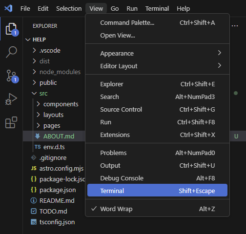

# Страница с контактами групы помощи DRA

Сделана на [astro.js](https://astro.build/).\
Обрати внимание на файл [README.md](/README.md). Там есть список команд и информация о структуре проекта.

## Перед стартом

### Необходимые инструменты

Для работы с приложением нужно установить свежую версию [NodeJS](https://nodejs.org/en). Установщик на можно скачать [здесь](https://nodejs.org/en/download/prebuilt-installer). NodeJS поставляется с пакетным менеджером npm, он необходим для сборки и локального запуска(отладки) приложения. 

Также рекомендую установть [VSCode](https://code.visualstudio.com/) для работы с кодом и запуска команд.

### Запуск команд

Доступные пользовательские команды содержатся в [package.json](/package.json). Для запуска команды надо ввести \
`npm run имя_команды`.\
(Ключевое слово `run` опционально. Его можно не писать в некоторых пользовательских командах и оно не испоьзуется в комндах, зашитых в npm).

Команды запускаются в комадной строке в корне проекта. В windows это можно делать стандартной утилитой CMD или, если ты используешь VSCode, можно воспользоваться встроенным терминалом:

### Установка зависисмостей

Следующая команда установит нужные проекту пакеты в директорию node_modules в корне проекта(команда `install` или просто `i` не является пользовательской, она зашита в сам сборщик, поэтому перед ней мы не пишем `run`):

`npm install`

После этого можно будет сделать сборку или запустить приложение локально для отладки.

## Сборка 

Сборка запускается командой

`npm run build`

После чего в корне проекта появится директория `dist` со сборкой проекта. Именно эту директорию нужно залить на сервер.

После загрузки сборки на сервер, нужно будет запустит утилиту для раздачи файлов по сети, например [http-server](https://www.npmjs.com/package/http-server) или воспользоваться любым другим спосбом публикации htm страниц. 

Обрати внимание на страницу про деплой из документации Astro: [ссылка](https://docs.astro.build/en/guides/deploy/).

## Отладка

Локально приложение запускается командой

`npm start`

После чего страница будет доступна на http://localhost:4321

В проекте уже настроен hot reload, т.е все изменения должны применяться сразу, без перезагрузки страницы.

